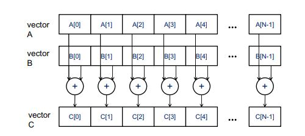

# Introduction to Data Paralleism and CUDA C
        
## Parallelism
When talking about Parallelism, the first thing we consider is Task Paralleism.
### Task Parallelism 
Task Parallelism is what is known as multiple processing.  What happens is that each task gets distributed towards each core on the CPU. The cores will set priority for those individual task.      

An example would be: doing homework while eating and AFK grinding on a video game. Each task isn't really done at the same time, some may be done at different times and have different priorities. 

For this worrkshop, we are focusing more on Data Parallelism.
### Data Parallelism
Data Parallelism is running the same task with different components of data on each core.       

A good example of this would be vector addition where every element in the array is added individually with respect to their index. Each calculation is utilizing one core. 




### Trade off between Task Parallelism and Data Parallelism
The trade off between task and data parallelism would be dependent on the operat ion and the amount of data required for the operation 
#### CPU
1. The cores on the CPU is are faster and smarter than the GPU.
2. There a limit amount of cores on the CPU
3. Good for small amount of data and any calculations that requires logic
#### GPU
1. The cores on the GPU is slower and isn't built logically compared to CPU
2. There is a lot of cores, over 1000 at least, on the GPU
3. Best used for large set of data that can 
4. Thread divergence: stalling is introduce due to some threads require instructions, will occur


### Function Declaration
There are 3 types of function declaration that is specified by nvcc     
``
__host__: called and executed on the host(cpu)                  
__device__: called and executed on a device(gpu)                    
__global__: called on the host and executes on the device           
``     


#### __host__ functions
Host function are the common functions that we write in general. 
```angular2
int add(int x, int y){
    return x + y;
}
```
Host functions are functions that are
1. compiles by g++/gcc
2. Host functions can only be called by other host functions

```angular2
 __host__ int add(int x, int y){                                                                        
    return x + y;
}
```


#### __device__ functions
Device function are function that are
1. compiled by nvcc 
2. Once called, the only way out is to return
3. Only device functions can call other device functions

```angular2
__device__ int add(int x, int y){
    return x + y;
}
```
#### __global__ functions
Global function are functions that are
1. device functions that are executed from host
2. they are void type functions
3. Requires specified kernel dimensions

```angular2
__global__ void MatrixMulKernel(float* d_M, float* d_N, float* d_P, int Width) {
    // Calculate the row index of the d_Pelement and d_M
    int Row = blockIdx.y*blockDim.y+threadIdx.y;

    // Calculate the column index of d_P and d_N
    int Col = blockIdx.x*blockDim.x+threadIdx.x;

    if ((Row < Width) && (Col < Width)) {
        float Pvalue = 0;
        // each thread computes one element of the block sub-matrix
        for (intk = 0; k < Width; ++k) {
            Pvalue += d_M[Row*Width+k]*d_N[k*Width+Col];
        }
        d_P[Row*Width+Col] = Pvalue;
    }
}
```
Global functions and kernels will be thoroughly explained in the next section, Threading

