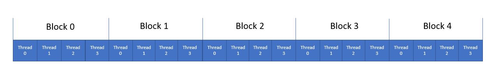

# Kernel and Threads
In order to understand this section, i recommend a refresher on pointers. The foundation of pointers are very crucial on how threads are operated in a kernel. 
https://github.com/ajpasic/computing-for-efficient-engineers/blob/main/pointers/pointer.pdf

## What is a Kernel
A kernel is a global function that is executed on the GPU where the function tasks are allocated on the GPU based on certain structure of how the threads are organized.

A thread is a task that is specified on 1 CUDA core

The organization of threads and how to call global function are shown below:
```angular2
kernelFunction: The name of your global function
gridDim: the number of blocks per grid
blockDim: the number of threads per block
blockIdx: the index of the current block
threadIdx: the index of the current thread

kernelFunction <<< gridDim, blockDim >>>(parameters used for global function)
```


## Device Global Memory and Data Transfer
The communication between host and device is shown below


### Cuda Functions
The concepts of dynamic allocation and freeing memory is important. From the pointer tutorial, you should already know about malloc and free. There is a cuda counterpart

#### 1.cudaMalloc
This cuda function allocates memory to the device
```angular2
cudaMalloc(&GPU_pointer, size): Allocates object in the device global memory
GPU_pointer: Address of a pointer to allocate memory
size: allocation memory size in terms of bytes
```
#### 2.cudaFree
This cuda function frees the memory from the device.
```angular2
cudaFree(&GPU_pointer): Free objects from device global memory
GPU_pointer: pointer to free object

```
#### 3.cudaMemcpy
This cuda function allows you copy memory from one host/device to another host/device. It the main function that allows communication between host and device

```angular2
cudaMemcpy(&dest, &source, size, mdt): memory data transfer from host to device or device to host

&dest: destination pointer, can either be pointer from host or device (depending on mdt)
&source: the source pointer, can either be pointer from host or device (depending on mdt)
If destination is device, then source is host
size: the memory transfer size in bytes
mdt(memory data transfer): only have 2 options (source -> dest)
1. cudaMemcpyHosttoDevice
2. cudaMemcpyDevicetoHost
```

Anything in host stays in host and anything in device stays in device. If you want values that were stored from host to be used in device functions, you need to transfer them over. At the same time, when calculations are done and you want the results, you have to transfer them back to host.
## Kernel Functions and Threading

Kernel Function are consider global function where a kernel is defined based on the block and thread dimension
You can somewhat view the kernel as an initial conditions on a double for loop, but only for the 1-D grid case. 


<table>
<tr>
<th>Host</th>
<th>Kernel</th>
</tr>
<tr>
<td>
<pre>
int main(){
    int i = 0;
    for (int m=0; m <5; m++){
        for (int n = 0; n <4; n++){
            i = m*n + n;
            ....
        }
    }
}
</pre>
</td>
<td>

```Kernel
// function prototype
__global__ kernelFunction();

int main(){
    int gridDim=5;
    int blockDim = 4;
    kernelFunction <<< gridDim, blockDim >>> ()
}
__global__ kernelFunction (){
    i = blockIdx.x * blockDim.x + threadIdx.x;
    ....
}
```

</td>
</tr>
</table>

For visual representation


Now lets do an example vector addition function. What is shown below is just a brief aspect of vector Addition.
<table>
<tr>
<th>Host</th>
<th>Kernel</th>
</tr>
<tr>
<td>
<pre>
void vecAdd(float*, float*, float*, int, int);

int main(){
    float* A, float* B, float* C;
    vecAdd(C, A, B, 5, 4)
}

vecAdd(float* C, float* A, float* B, int m, int n){
    for (int i = 0; i < m; i++){
        for (int j = 0; j < n; j++){
            C[i * j + j] = A[i * j + j] + B[i * j + j];
        }
    }
}

</pre>
</td>
<td>

```Kernel
// function prototype
__global__ void vecAdd(float*, float*, float*, int);

int main(){
    int gridDim, blockDim, n;
    float* A, float* B, float* C;
    gridDim = 5;
    blockDim = 4;
    n = gridDim*blockDim;
    
    vecAdd <<< gridDim, blockDim >>>(C, A, B, n);
}
__global__ kernelFunction (float* C, float* A, float*B, int n){
    int i = blockIdx.x * blockDim.x + threadIdx.x;
    if (i <n) 
        C[i] = A[i] + B[i];
    
    ....
}
```

</td>
</tr>
</table>

## Multi-dimensional grids
Multi-dimension grid required a certain keyword called dim3. dim3 takes in a minimum of 1 argument and a max of 3 arguments. Each argument represents a dimension of how blocks would be organized on a grid or how threads would be organized on a box based on (x, y, z). For example
```angular2
dim3 dimBlock(2,2,1)
dim3 dimThread(4,2,2)
kernelFunction <<<dimBlock, dimThread>>>()
```
This show that the grid consist of 2x2x1 grid that each block in that grid contain 4x2x2 threads. The illustration is shown below.


## Assignment

1. Print hello world multiple times by making a kernel, size of your choice, using a global function and navigate which block and thread hello world is printed
2. Complete the vector addition program using global function and the concept from this document, navigate where the calculation occurs in which block and thread.
3. Write a matrix multiplication program using global function and the concept from this document. Need to consider multidimensional grids.
